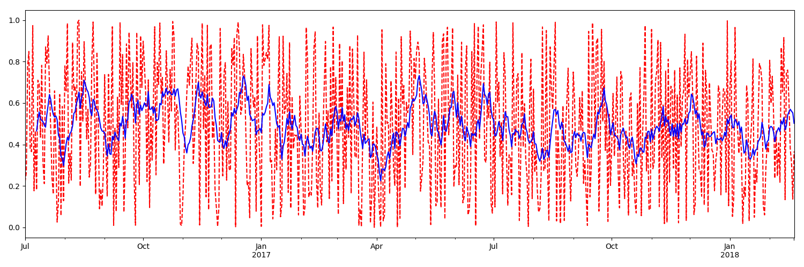

# 1.时间序列

## 1.1 date_range

## 1.2 truncate过滤掉

## 1.3 使用时间索引

## 1.4 时间戳

## 1.5 时间区间

## 1.6 Time offsets

## 1.7 时间戳和周期可以相互转换
时间戳与时间周期的区别在于如果有一点时间包含在那个时间周期中，切片时那个时间周期全部选中

# 2.数据重采样

## 2.1 降采样

## 2.2 升采样
插值填充
ffill空值取前面的值
bfill空值取后面的值
interpolate线性取值
# 3.滑动窗口

# 4.ARIMA实例 预测股票
## 4.1 用时间来当作索引,并将日期处理成标准格式
## 4.2 此时可以发现数据的平稳性较差，进行差分
## 4.3计算acf值 pacf值
## 4.4 预测，起始时间必须是从已知的时间开始

